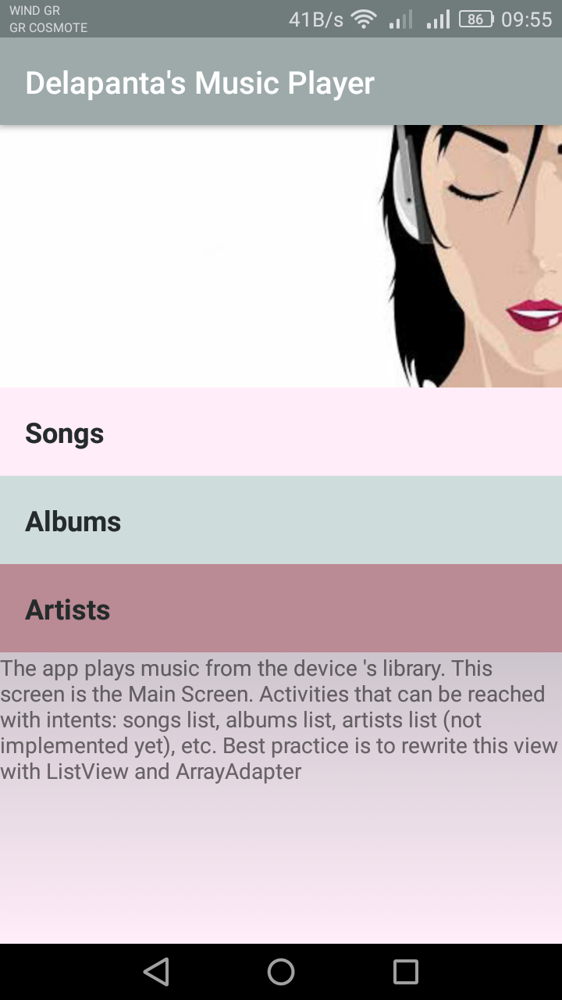

# MusicalStructureApp

The app plays music from the user device's library.
Available screens:
<ul>
  <li>Main Screen. 
    Activities that can be reached with intents: <ul><li>songs list</li>
    <li>albums list</li> <li>artists list (not implemented yet)</li> <li>etc (not implemented yet)</li></ul> 
    Best practice is to rewrite this view with ListView and ArrayAdapter</li>
  <li> Songs Screen. 
    Activities that can be reached with intents: <ul><li>song1</li><li>song2 (not implemented yet)</li><li>etc (not implemented yet)</li></ul>
    Best practice is to rewrite this view with ListView and ArrayAdapter</li>
  <li> Albums Screen (now only the layout). 
    Best practice is to rewrite this view with ListView or GridView and ArrayAdapter</li>
  <li>Playing now Screen.
    It is reached by selecting the first song from songs category. It contains: 
    <ul>
      <li>a fab icon for adding the song to a playlist (not functioning yet)</li>
      <li>a SeekBar</li>
      <li>button for play/pause</li>
      <li>skip next button</li>
      <li>skip previous button</li></ul></li>
</ul>

<h2>App's screenshot</h2>

